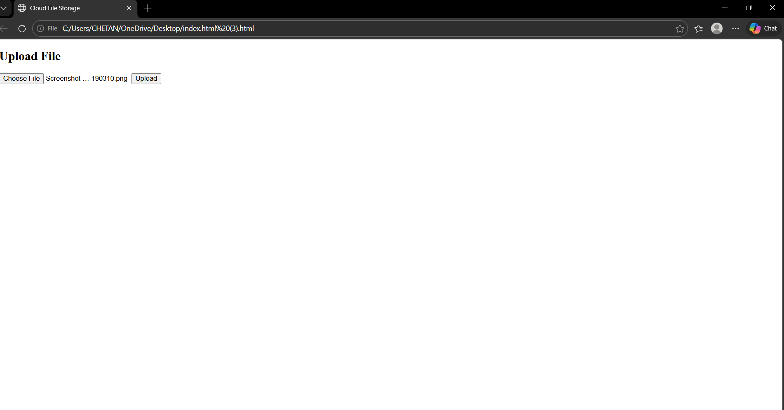
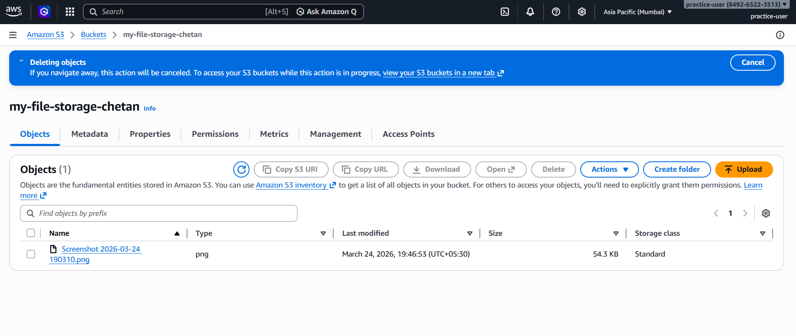

# ☁️ Cloud-Based File Storage System

## 📌 Project Overview

This project is a simple cloud-based file storage system inspired by Google Drive. It allows users to upload and access files using Amazon S3 cloud storage.

---

## 🚀 Features

* Upload files to cloud storage
* Store files in Amazon S3
* Access files using public URLs
* Simple web interface

---

## 🛠️ Technologies Used

* HTML
* JavaScript
* Amazon S3 (AWS)

---

## 🧩 Project Architecture

User → Browser → JavaScript → Amazon S3

---

## 📂 How It Works

1. User selects a file
2. File is uploaded to S3 bucket
3. File is stored in cloud
4. File can be accessed anytime

---

## 📸 Screenshots

### 🔹 Upload Interface

### 🔹 File Stored in S3

---

## ⚠️ Limitations

* No authentication implemented
* Public access enabled for demo
* Basic UI

---

## 🔮 Future Scope

* Add login system (OAuth 2.0)
* Secure file upload using pre-signed URLs
* Improve UI/UX

---

## 👨‍💻 Author

Chetan Arjun

---

## 📌 Conclusion

This project demonstrates how cloud storage works using AWS S3 and provides a basic implementation of a file storage system similar to Google Drive.
